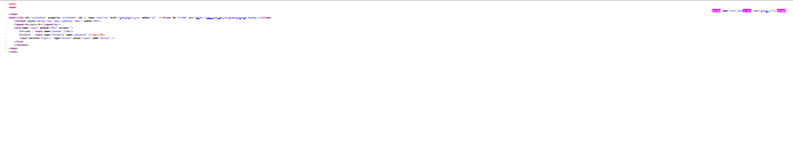

# Javascript - Authentication

* Открываем исходны код
* Не видим Javascript, но видим что в onclick кнопки установлена функция Login()
* На стандартную функцию js не похоже, на всякий случай гуглим и проверяем что такой нет
  * Значит где-то она должна подключаться к файлу
  * Запускаем burp и видим в ответе подгружаемый js файл
  * Может быть js удаляет тег script со страницы, после выполненя кода? 
    * Нет, всё проще 
    * Важно, что если вы захотите воспользоваться Repeater в Burp, то нужно из запроса удалить заголовки связанные с кэшем
* Смотрим js файлик, видим пароль
* Сдаём пароль